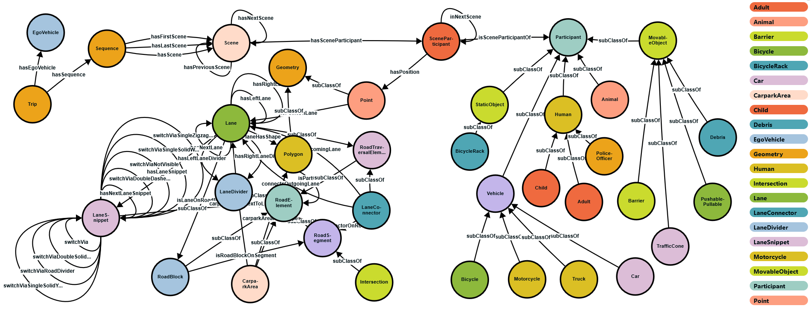
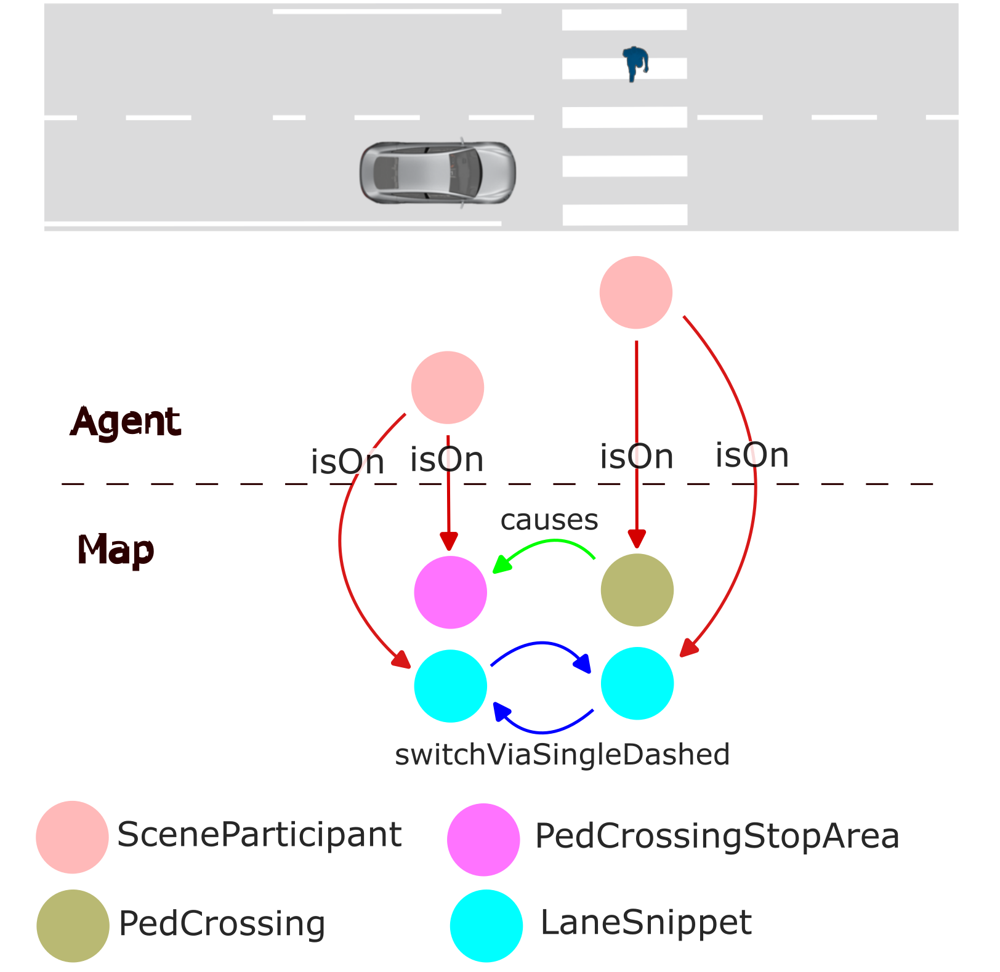

# nuScenes_Knowledge_Graph  
Ontologies and Knowledge Graphs of the ICCV 2023 workshop paper:
- Mlodzian, L., Sun, Z., Berkemeyer, H., Monka, S., Wang, Z., Dietze, S., Halilaj, L., & Luettin, J. (2023). [nuScenes Knowledge Graph - A comprehensive semantic representation of traffic scenes for trajectory prediction.](http://ieeexplore.ieee.org/stamp/stamp.jsp?tp=&arnumber=10350942) 2023 IEEE/CVF International Conference on Computer Vision Workshops (ICCVW), 42-52.

## [Content](https://zenodo.org/records/10074393)
  - **nSKG** (nuScenes Knowledge Graph): knowledge graph for the [nuScenes dataset](https://www.nuscenes.org/nuscenes), that models all scene participants and road elements, as well as their semantic and spatial relationships
  - **nSTP** (nuScenes Trajectory Prediction Graph): heterogeneous graph of the nuScenes dataset for trajectory prediction in [PyTorch Geometric (PyG)](https://pytorch-geometric.readthedocs.io/en/latest/) format. It extends nSKG for example by transformation into agents' local coordinate systems, relevant agent extraction, semantic relationships between agents.
  - **nuScenes_agent_onto**: ontology for the traffic participants (agents)
  - **nuScenes_map_onto**: ontology for the extended map
  - **stardog_rules**: [SPARQL](https://www.w3.org/TR/rdf-sparql-query/) rules for mapping nuScenes concepts to the agent ontology

The content is available at [Zenodo](https://zenodo.org/records/10074393)




## How to use
**nSKG** represents the KG created on the basis of the nuScenes ontologies nuScenes_agent_onto.ttl and nuScenes_map_onto.ttl and materializing the [nuScenes annotation dataset](https://www.nuscenes.org/nuscenes#data-annotation). It can be used for applications where relational information between entities are important. The ontologies are in [Turtle](https://www.w3.org/TR/turtle/) format and can be viewed by ontology editors such as [Protege](https://protege.standord.edu/). 

**nSTP** represents the extended version of nSKG, where agents are represented in local coordinate systems to enforce shift- and rotation-invariance. It also includes semantic relationships between agents, e.g. whether agents are on neighboring lanes, the same lane or might intersect. This is done based on the semantic scene graph describe in [(Towards Traffic Scene Description: The Semantic Scene Graph)](https://arxiv.org/abs/2111.10196). The data is provided in [PyTorch Geometric](https://pyg.org/) format and directly be used to train graph neural network for trajectory prediction.


<p align=center>

</p>

## Publications using the nuScenes Knowledge Graph
- Sun, Z., Wang, Z., Halilaj, L., & Luettin, J. (2024). SemanticFormer: Holistic and Semantic Traffic Scene Representation for Trajectory Prediction using Knowledge Graphs. To appear in IEEE Robotics and Automation Letters. Preprint: [ArXiv, abs/2404.19379](https://arxiv.org/abs/2404.19379).
- Wang, Z., Sun, Z., Luettin, J., & Halilaj, L. (2024). SocialFormer: Social Interaction Modeling with Edge-enhanced Heterogeneous Graph Transformers for Trajectory Prediction. [ArXiv, abs/2405.03809](https://arxiv.org/abs/2405.03809).
- (please let us know if you like us to add your article here)

## Related work
- Grimm, D., Zipfl, M., Hertlein, F., Naumann, A., Lüttin, J., Thoma, S., Schmid, S., Halilaj, L., Rettinger, A., & Zöllner, J.M. (2023). [Heterogeneous Graph-based Trajectory Prediction using Local Map Context and Social Interactions.](http://ieeexplore.ieee.org/stamp/stamp.jsp?tp=&arnumber=10422462) 2023 IEEE 26th International Conference on Intelligent Transportation Systems (ITSC), 2901-2907.
- Naumann, A., Hertlein, F., Grimm, D., Zipfl, M., Thoma, S., Rettinger, A., Halilaj, L., Luettin, J., Schmid, S., & Caesar, H. (2023). [Lanelet2 for nuScenes: Enabling Spatial Semantic Relationships and Diverse Map-based Anchor Paths.](http://ieeexplore.ieee.org/stamp/stamp.jsp?tp=&arnumber=10209046) 2023 IEEE/CVF Conference on Computer Vision and Pattern Recognition Workshops (CVPRW), 3248-3257.
- Halilaj, L., Luettin, J., Monka, S., Henson, C.A., & Schmid, S. (2023). [Knowledge Graph-Based Integration of Autonomous Driving Datasets.](https://doi.org/10.1142/s1793351x23600048) Int. J. Semantic Comput., 17, 249-271.
- Zipfl, M., Hertlein, F., Rettinger, A., Thoma, S., Halilaj, L., Luettin, J., Schmid, S., & Henson, C.A. (2022). [Relation-based Motion Prediction using Traffic Scene Graphs.](http://ieeexplore.ieee.org/stamp/stamp.jsp?tp=&arnumber=9922155) 2022 IEEE 25th International Conference on Intelligent Transportation Systems (ITSC), 825-831.
- Luettin, J., Monka, S., Henson, C.A., & Halilaj, L. (2022). [A Survey on Knowledge Graph-based Methods for Automated Driving.](https://arxiv.org/pdf/2210.08119.pdf) Knowledge Graphs and Semantic Web - 4th Iberoamerican Conference and third Indo-American Conference, {KGSWC} 2022, Madrid, Spain, November 21-23, 2022, Proceedings.
- Halilaj, L., Luettin, J., Henson, C.A., & Monka, S. (2022). [Knowledge Graphs for Automated Driving.](http://ieeexplore.ieee.org/stamp/stamp.jsp?tp=&arnumber=9939271) 2022 IEEE Fifth International Conference on Artificial Intelligence and Knowledge Engineering (AIKE), 98-105.
- Schukraft, M., Rothermel, S., Luettin, J., & Halilaj, L. (2021). [Towards a Rule-based Approach for Estimating the Situation Difficulty in Driving Scenarios.](https://pdfs.semanticscholar.org/b2c8/74f2a361697e29342df937a788151b768b30.pdf) International Conference on Vehicle Technology and Intelligent Transport Systems.
- Halilaj, L., Luettin, J., Rothermel, S., Arumugam, S.K., & Dindorkar, I. (2021). [Towards a knowledge graph-based approach for context-aware points-of-interest recommendations.](http://dl.acm.org/citation.cfm?id=3442056) Proceedings of the 36th Annual ACM Symposium on Applied Computing.
- Halilaj, L., Dindorkar, I., Luettin, J., & Rothermel, S. (2021). [A Knowledge Graph-Based Approach for Situation Comprehension in Driving Scenarios.](https://doi.org/10.1007/978-3-030-77385-4_42) Extended Semantic Web Conference.
- Werner, S., Rettinger, A., Halilaj, L., & Luettin, J. (2021). [Embedding Taxonomical, Situational or Sequential Knowledge Graph Context for Recommendation Tasks.](https://pdfs.semanticscholar.org/84da/9419342fbfeab0c0ca6935503fcace4b5bf5.pdf) International Conference on Semantic Systems.
- Werner, S., Rettinger, A., Halilaj, L., & Luettin, J. (2020). [RETRA: Recurrent Transformers for Learning Temporally Contextualized Knowledge Graph Embeddings.](https://doi.org/10.1007/978-3-030-77385-4_25) Extended Semantic Web Conference.
  
## Acknowledgements
Special thanks to Motional for the permission to distribute this modified version of the nuScenes dataset.

## Citation
If you use this work please cite
```
@inproceedings{
title={nuScenes Knowledge Graph - A comprehensive semantic representation of traffic scenes for trajectory prediction},
author={Leon Mlodzian and Zhigang Sun and Hendrik Berkemeyer and Sebastian Monka and Zixu Wang and Stefan Dietze and Lavdim Halilaj and Juergen Luettin},
booktitle={International Conference on Computer Vision (ICCV), Workhsop on Scene Graphs and Graph Representation Learning (SG2RL)},
year={2023}
}
```
## License
Shield: [![CC BY-NC-SA 4.0][cc-by-nc-sa-shield]][cc-by-nc-sa]

This work is licensed under a
[Creative Commons Attribution-NonCommercial-ShareAlike 4.0 International License][cc-by-nc-sa], 
with additional term described by the nuScenes [Terms of use](https://www.nuscenes.org/terms-of-use), in particular the "Licenses" section.

[![CC BY-NC-SA 4.0][cc-by-nc-sa-image]][cc-by-nc-sa]

[cc-by-nc-sa]: http://creativecommons.org/licenses/by-nc-sa/4.0/
[cc-by-nc-sa-image]: https://licensebuttons.net/l/by-nc-sa/4.0/88x31.png
[cc-by-nc-sa-shield]: https://img.shields.io/badge/License-CC%20BY--NC--SA%204.0-lightgrey.svg
